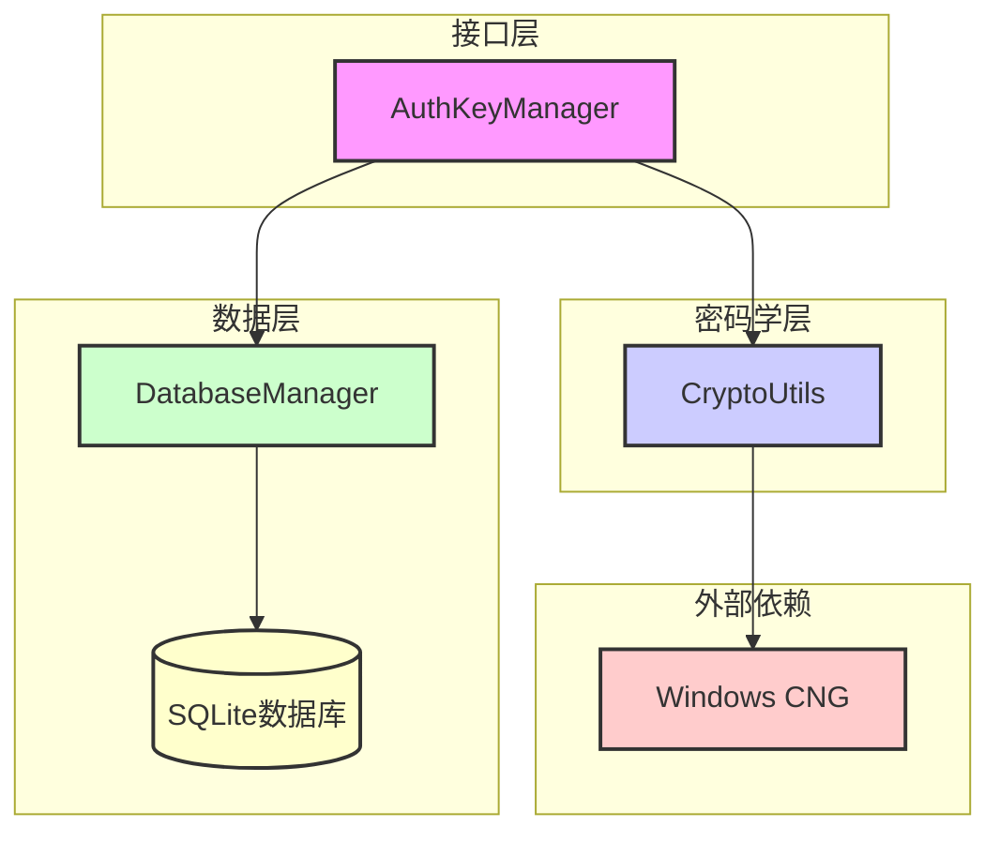
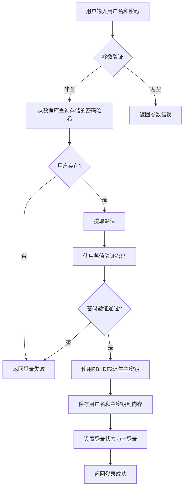
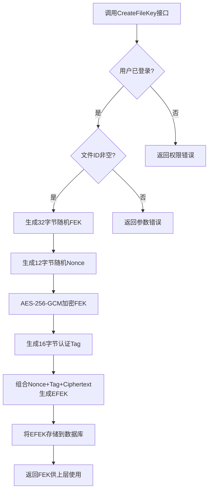
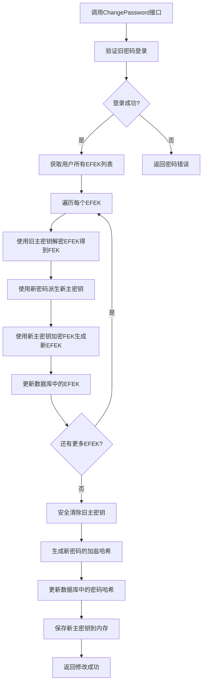
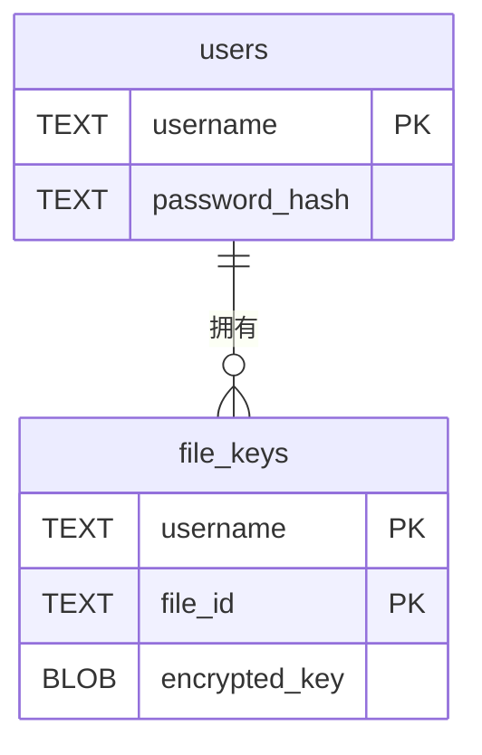
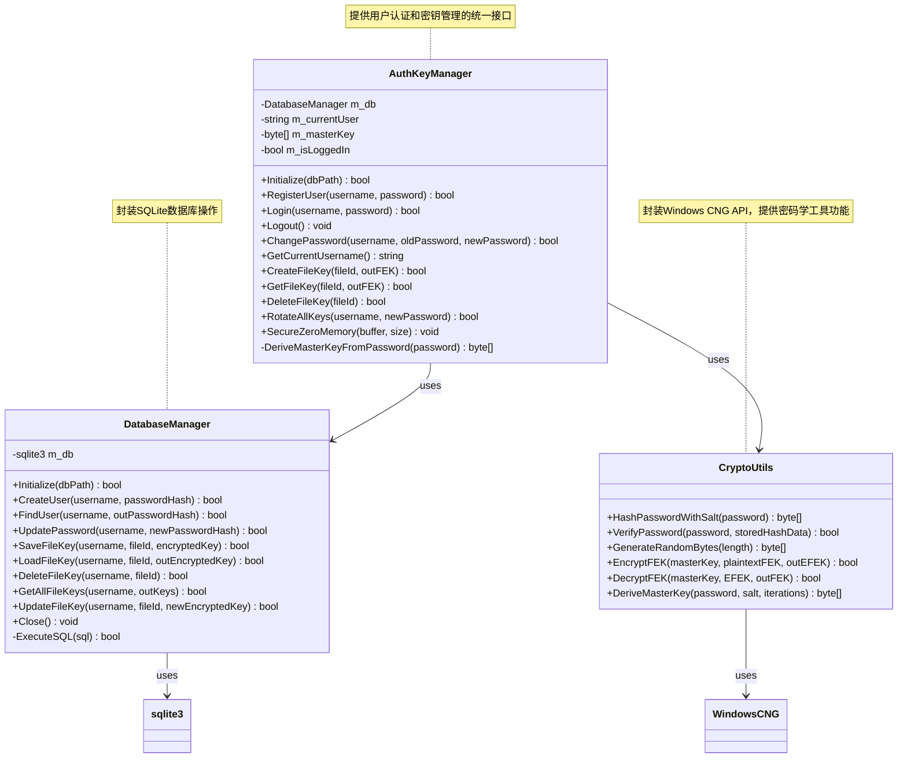

# SecureAuthKeyModule 安全认证与密钥管理模块实验报告

---

## 一、概述

### 项目背景

在文件访问控制系统中，用户认证和密钥管理是保障系统安全的核心组件。传统的密钥管理方式存在密钥明文存储、密码哈希算法强度不足、密钥轮换机制缺失等安全隐患。本实验设计并实现了SecureAuthKeyModule模块，通过安全的用户认证机制、基于密码派生的密钥管理方案和完整的密钥轮换功能，为文件访问控制系统提供坚实的安全基础。

本模块基于Windows CNG密码学库实现，采用AES-256-GCM加密算法保护文件加密密钥（FEK），使用SHA-256哈希算法进行密码验证，通过PBKDF2衍生用户主密钥（Master Key），确保密钥管理的安全性和可靠性。

### 项目意义

1. 实现安全的用户认证机制：密码使用SHA-256加盐哈希存储，防止密码泄露。
2. 实现文件加密密钥管理：FEK使用AES-256-GCM加密存储，保护密钥安全。
3. 实现密钥轮换机制：修改密码时自动轮换所有文件密钥，防止密钥泄露。
4. 培养密码学实践能力：深入理解Windows CNG API、AES-GCM加密、SHA-256哈希等核心技术。
5. 为文件访问控制系统提供安全基础：作为底层安全模块，支持上层文件加密功能。

---

## 二、系统分析

### 需求分析

根据信息系统安全课程设计要求，SecureAuthKeyModule模块需满足以下需求：

- 用户注册功能：支持新用户注册，密码使用加盐哈希存储。
- 用户登录功能：验证用户身份，成功后派生主密钥加载到内存。
- 用户登出功能：安全清除内存中的主密钥，防止内存dump攻击。
- 修改密码功能：验证旧密码，自动轮换所有文件密钥，更新密码哈希。
- 创建文件密钥功能：生成随机FEK，使用主密钥加密存储。
- 获取文件密钥功能：从数据库读取EFEK，使用主密钥解密还原FEK。
- 删除文件密钥功能：删除数据库中的EFEK记录。
- 密钥轮换功能：修改密码时使用新旧主密钥重新加密所有FEK。
- 密码哈希功能：生成包含盐值和哈希的安全密码存储格式。
- 密码验证功能：使用存储的盐值验证输入密码的正确性。
- FEK加密功能：使用AES-256-GCM加密FEK，生成包含Nonce、Tag、Ciphertext的EFEK。
- FEK解密功能：验证Tag后解密EFEK，还原原始FEK。
- 主密钥派生功能：使用PBKDF2从密码派生32字节主密钥。

---

## 三、系统设计

### 概要设计

SecureAuthKeyModule模块采用三层架构设计：

第一层为接口层，由AuthKeyManager类提供用户认证和密钥管理的统一接口；第二层为密码学层，由CryptoUtils类封装Windows CNG API，提供哈希计算、随机数生成、AES加密解密等功能；第三层为数据层，由DatabaseManager类封装SQLite数据库操作，负责用户信息和文件密钥的持久化存储。

模块的核心安全机制包括：密码使用SHA-256加盐哈希存储；主密钥从密码派生，仅在内存中临时存储；FEK使用AES-256-GCM加密后存储为EFEK；修改密码时自动轮换所有文件密钥；登出时使用SecureZeroMemory安全清除内存中的敏感数据。

#### 系统架构图

### 功能模块

系统分为以下三个核心模块：

用户认证模块：负责用户注册、登录、登出和密码修改功能。注册时生成随机盐值，将盐值与密码拼接后进行SHA-256哈希，存储到数据库。登录时使用存储的盐值验证密码，验证通过后派生主密钥加载到内存。登出时安全清除内存中的主密钥。修改密码时执行密钥轮换，更新密码哈希。

密钥管理模块：负责文件加密密钥的创建、获取、删除和轮换功能。创建FEK时生成32字节随机密钥，使用主密钥加密后存储。获取FEK时从数据库读取EFEK，解密后返回。删除FEK时清理数据库记录。密钥轮换时使用旧主密钥解密所有EFEK，使用新主密钥重新加密。

密码学工具模块：封装Windows CNG API，提供密码哈希、密码验证、随机数生成、AES-GCM加密解密、主密钥派生等功能。使用BCryptOpenAlgorithmProvider打开算法提供者，调用BCryptHashData进行哈希计算，调用BCryptEncrypt/BCryptDecrypt进行AES-GCM加密解密。

### 系统流程

#### 用户登录流程图

#### 文件密钥创建流程图

#### 密钥轮换流程图

### 详细设计

#### 数据库ER图

#### 类关系图

数据库设计包含两个表：users表存储用户名和密码哈希，username为主键，password_hash为非空TEXT字段；file_keys表存储用户的文件密钥，username和file_id为联合主键，encrypted_key为非空BLOB字段存储EFEK。

主要类设计：AuthKeyManager类包含Initialize、RegisterUser、Login、Logout、ChangePassword、GetCurrentUsername、CreateFileKey、GetFileKey、DeleteFileKey等方法，内部持有DatabaseManager实例和内存中的主密钥；CryptoUtils类为静态工具类，包含HashPasswordWithSalt、VerifyPassword、GenerateRandomBytes、EncryptFEK、DecryptFEK、DeriveMasterKey等静态方法；DatabaseManager类封装SQLite操作，包含Initialize、CreateUser、FindUser、UpdatePassword、SaveFileKey、LoadFileKey、DeleteFileKey、GetAllFileKeys、UpdateFileKey等方法。

核心数据结构：FEK为32字节AES-256密钥，用于直接加密文件；EFEK为加密后的FEK，格式为Nonce(12字节)+Tag(16字节)+Ciphertext(32字节)，共60字节；Master Key为32字节主密钥，从密码派生，用于加密FEK；密码哈希格式为Salt(16字节)+Hash(32字节)，共48字节。

---

## 四、系统实施

### 开发环境

操作系统为Windows 10/11（64位），开发语言为C++，使用Visual Studio 2022作为集成开发环境，编译器为MSVC 14.3+，密码学库采用Windows CNG（bcrypt.lib），数据库为SQLite 3.0+。

### 文件结构

SecureAuthKeyModule目录包含AuthKeyManager.h和AuthKeyManager.cpp实现用户认证和密钥管理接口；CryptoUtils.h和CryptoUtils.cpp实现密码学工具功能；DatabaseManager.h和DatabaseManager.cpp实现数据库操作；sqlite3.c和sqlite3.h为SQLite嵌入式数据库库；dllmain.cpp、framework.h、pch.cpp、pch.h为DLL项目框架文件；SecureAuthKeyModule.sln和SecureAuthKeyModule.vcxproj为Visual Studio解决方案和项目文件；x64/Debug目录包含编译生成的DLL和测试程序。

### 核心代码

用户认证核心代码：注册时生成随机盐值，将盐值与密码拼接后进行SHA-256哈希，存储到数据库；登录时从数据库获取存储的哈希数据，提取盐值验证密码，验证通过后派生主密钥加载到内存；登出时使用SecureZeroMemory安全清除内存中的主密钥；修改密码时验证旧密码，执行密钥轮换，更新密码哈希和主密钥。

密码学核心代码：密码哈希生成16字节随机盐值，将盐值与密码拼接后执行SHA-256哈希，返回盐值和哈希的组合数据；密码验证使用存储的盐值对输入密码进行哈希计算，比对验证；随机数生成优先使用CNG随机数生成器，失败时使用C++标准库作为备选；AES-GCM加密生成12字节Nonce和16字节Tag，组合Nonce、Tag、Ciphertext生成EFEK；AES-GCM解密验证Tag后还原原始FEK；主密钥派生执行10000次SHA-256哈希迭代，生成32字节主密钥。

数据库操作核心代码：用户表创建包含username和password_hash字段；文件密钥表创建包含username、file_id和encrypted_key字段；用户操作使用SQL语句实现用户创建、查询和密码更新；文件密钥操作使用参数化查询实现密钥存储、加载和删除，防止SQL注入攻击。

---

## 五、系统运行与测试

### 系统启动

编译项目生成SecureAuthKeyModule.dll和TestAuthKey.exe；运行测试程序加载DLL并调用接口；测试程序初始化模块，指定数据库文件路径；执行用户注册、登录、密钥创建、密钥获取、密钥删除、密码修改等测试用例；输出测试结果到控制台。

### 功能测试

用户注册测试：新用户注册成功，重复用户名注册失败；验证数据库中密码字段为十六进制字符串，非明文。

用户登录测试：正确密码登录成功，错误密码登录失败；登录后可获取当前用户名；登出后无法获取用户名。

文件密钥测试：登录后创建文件密钥成功，获取密钥成功；删除密钥后无法获取；未登录时创建和获取密钥失败。

密码修改测试：修改密码后使用旧密码登录失败，使用新密码登录成功；密钥轮换后文件密钥可正常获取。

密码学测试：相同密码生成相同哈希，不同密码生成不同哈希；FEK加密后无法直接读取，解密后恢复原始值；主密钥派生长度为32字节。

### 安全测试

内存安全测试：登出后检查内存中的主密钥数组内容全为0；验证使用了SecureZeroMemory函数。

数据库安全测试：数据库中file_keys表存储的是BLOB数据，无法直接读取FEK；验证使用了参数化查询，防止SQL注入。

加密安全测试：验证AES-GCM加密使用了12字节Nonce和16字节Tag；验证解密时验证了Tag，篡改数据时解密失败。

---

## 六、总结

### 项目成果

本项目成功实现了SecureAuthKeyModule安全认证与密钥管理模块，主要成果包括：实现安全的用户认证系统，密码使用SHA-256加盐哈希存储；实现文件加密密钥管理，FEK使用AES-256-GCM加密存储；实现密钥轮换机制，修改密码时自动轮换所有文件密钥；封装Windows CNG密码学API，提供哈希计算、随机数生成、AES加密解密功能；实现SQLite数据库操作，支持用户信息和文件密钥的持久化存储；提供统一的模块接口，便于集成到文件访问控制系统中。

### 关键技术难点与解决方案

密码安全存储：使用SHA-256哈希算法，每个用户使用独立随机盐值，防止彩虹表攻击。

密钥安全管理：主密钥仅在内存中临时存储，登出时使用SecureZeroMemory安全清除，防止内存dump攻击。

FEK加密存储：使用AES-256-GCM加密FEK，生成包含Nonce和Tag的EFEK，确保数据机密性和完整性。

密钥轮换：修改密码时使用新旧主密钥重新加密所有FEK，防止旧密码泄露导致密钥泄露。

CNG API使用：封装Windows CNG API，处理算法提供者打开、密钥生成、加密解密等复杂流程，提供简化接口。

### 安全意识提升

通过本项目的实践，深刻理解了信息系统安全的核心概念：用户认证的重要性和实现方法；密码安全存储的最佳实践；密钥管理的安全原则；AES-GCM加密模式的工作原理；内存安全和数据清除的必要性；SQL参数化查询防止注入攻击。

### 改进方向

使用真正的PBKDF2算法：当前主密钥派生使用简化的哈希迭代方式，应使用CNG的BCryptKeyDerivation函数实现标准PBKDF2。

实现主密钥盐值个性化：当前使用固定盐值派生主密钥，应为每个用户生成独立的主密钥盐值并存储。

添加密钥版本管理：支持密钥版本升级和回滚。

实现密钥备份和恢复功能：支持加密密钥的安全备份和恢复。

添加多线程安全支持：当前实现未考虑多线程并发访问，应添加线程同步机制。

增加单元测试覆盖率：完善测试用例，覆盖各种边界条件和异常情况。