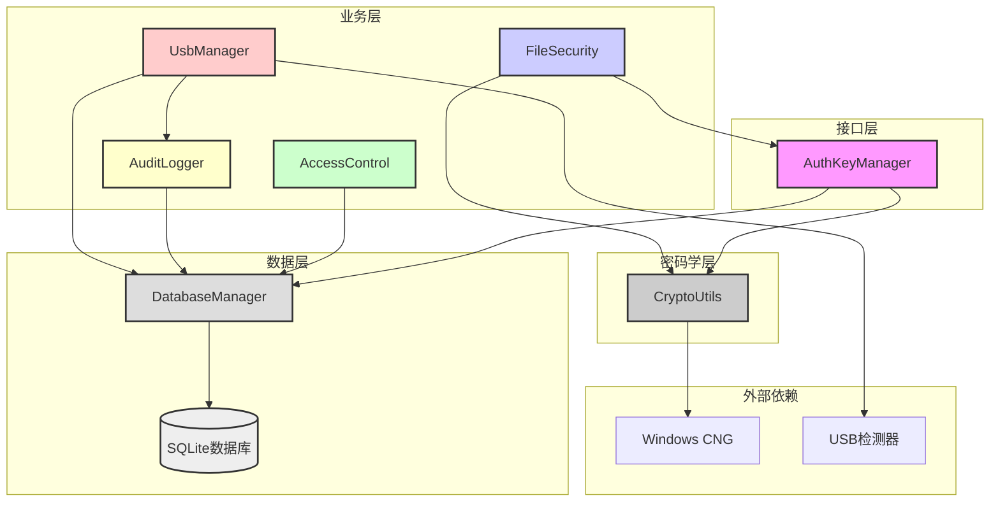
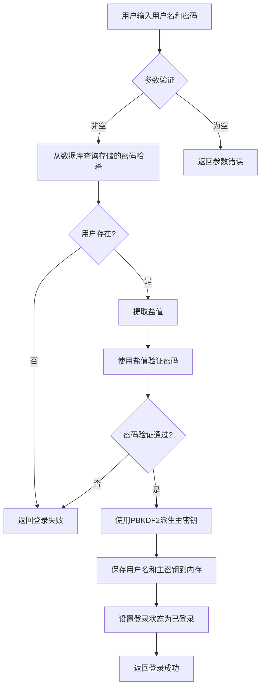
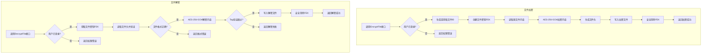
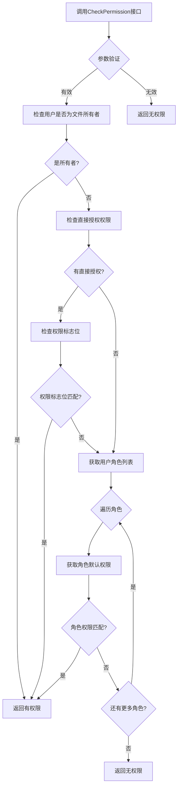
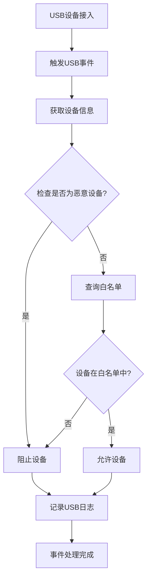
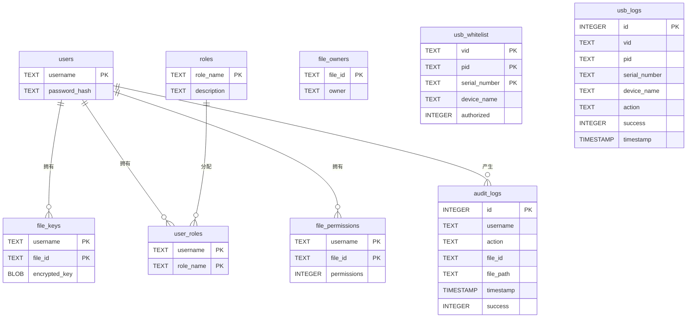
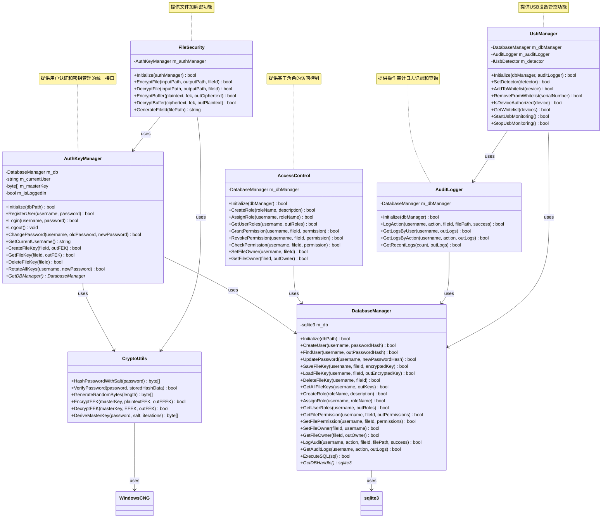

# SecureAuthKeyModule 安全认证与密钥管理模块实验报告

---

## 一、概述

### 项目背景

在文件访问控制系统中，用户认证和密钥管理是保障系统安全的核心组件。传统的密钥管理方式存在密钥明文存储、密码哈希算法强度不足、密钥轮换机制缺失等安全隐患。本实验设计并实现了SecureAuthKeyModule模块，通过安全的用户认证机制、基于密码派生的密钥管理方案和完整的密钥轮换功能，为文件访问控制系统提供坚实的安全基础。

本模块基于Windows CNG密码学库实现，采用AES-256-GCM加密算法保护文件加密密钥（FEK），使用SHA-256哈希算法进行密码验证，通过PBKDF2衍生用户主密钥（Master Key），确保密钥管理的安全性和可靠性。

### 项目意义

1. 实现安全的用户认证机制：密码使用SHA-256加盐哈希存储，防止密码泄露。
2. 实现文件加密密钥管理：FEK使用AES-256-GCM加密存储，保护密钥安全。
3. 实现密钥轮换机制：修改密码时自动轮换所有文件密钥，防止密钥泄露。
4. 实现文件级加密：支持AES-256-GCM文件加密和解密，保护文件内容安全。
5. 实现基于角色的访问控制：支持多角色权限管理，防止越权访问。
6. 实现操作审计日志：记录所有操作，确保安全可追溯。
7. 实现USB端口管控：白名单机制防止未授权设备接入。
8. 培养密码学实践能力：深入理解Windows CNG API、AES-GCM加密、SHA-256哈希等核心技术。

---

## 二、系统分析

### 需求分析

根据信息系统安全课程设计要求，SecureAuthKeyModule模块需满足以下需求：

- 用户注册功能：支持新用户注册，密码使用加盐哈希存储。
- 用户登录功能：验证用户身份，成功后派生主密钥加载到内存。
- 用户登出功能：安全清除内存中的主密钥，防止内存dump攻击。
- 修改密码功能：验证旧密码，自动轮换所有文件密钥，更新密码哈希。
- 创建文件密钥功能：生成随机FEK，使用主密钥加密存储。
- 获取文件密钥功能：从数据库读取EFEK，使用主密钥解密还原FEK。
- 删除文件密钥功能：删除数据库中的EFEK记录。
- 密钥轮换功能：修改密码时使用新旧主密钥重新加密所有FEK。
- 文件加密功能：使用FEK对文件进行AES-256-GCM加密。
- 文件解密功能：使用FEK对加密文件进行解密，验证认证Tag。
- 角色管理功能：创建角色，分配角色给用户。
- 权限管理功能：授予和撤销用户对文件的权限。
- 权限检查功能：验证用户是否拥有指定文件的权限。
- 审计日志功能：记录所有操作，支持按用户、操作类型查询。
- USB管控功能：白名单管理、设备授权验证、USB事件监控。

---

## 三、系统设计

### 概要设计

SecureAuthKeyModule模块采用分层架构设计：

第一层为接口层，由AuthKeyManager类提供用户认证和密钥管理的统一接口；第二层为密码学层，由CryptoUtils类封装Windows CNG API，提供哈希计算、随机数生成、AES加密解密等功能；第三层为数据层，由DatabaseManager类封装SQLite数据库操作，负责用户信息和文件密钥的持久化存储；第四层为业务层，包含FileSecurity（文件安全）、AccessControl（访问控制）、AuditLogger（审计日志）、UsbManager（USB管控）四个业务模块。

模块的核心安全机制包括：密码使用SHA-256加盐哈希存储；主密钥从密码派生，仅在内存中临时存储；FEK使用AES-256-GCM加密后存储为EFEK；修改密码时自动轮换所有文件密钥；登出时使用SecureZeroMemory安全清除内存中的敏感数据；基于角色的访问控制；操作审计日志；USB设备白名单管控。

#### 系统架构图

### 功能模块

系统分为以下六个核心模块：

用户认证模块：负责用户注册、登录、登出和密码修改功能。注册时生成随机盐值，将盐值与密码拼接后进行SHA-256哈希，存储到数据库。登录时使用存储的盐值验证密码，验证通过后派生主密钥加载到内存。登出时安全清除内存中的主密钥。修改密码时执行密钥轮换，更新密码哈希。

密钥管理模块：负责文件加密密钥的创建、获取、删除和轮换功能。创建FEK时生成32字节随机密钥，使用主密钥加密后存储。获取FEK时从数据库读取EFEK，解密后返回。删除FEK时清理数据库记录。密钥轮换时使用旧主密钥解密所有EFEK，使用新主密钥重新加密。

文件安全模块：负责文件级加密和解密功能。加密文件时创建FEK，使用AES-256-GCM加密文件内容，生成包含Magic、版本、文件大小、Nonce、Tag的文件头，写入加密文件。解密文件时读取文件头验证格式，获取FEK解密文件内容，验证认证Tag。

访问控制模块：负责基于角色的权限管理。支持创建角色、分配角色、授予权限、撤销权限、检查权限等功能。权限检查遵循优先级：文件所有者拥有全部权限，直接授权权限优先，角色默认权限兜底。

审计日志模块：负责操作日志的记录和查询。记录登录、登出、读取、写入、修改、删除、下载、加密、解密、权限变更等操作。支持按用户查询、按操作类型查询、查询最近日志。

USB端口管控模块：负责USB设备的白名单管理和事件监控。支持添加/移除白名单、验证设备授权、启动/停止USB监控。设备接入时自动检查白名单，授权设备允许接入，未授权设备阻止并记录日志。

### 系统流程

#### 用户登录流程图

#### 文件加解密流程图

#### 权限检查流程图

#### USB设备管控流程图

### 详细设计

#### 数据库ER图

#### 类关系图

核心数据结构：FEK为32字节AES-256密钥，用于直接加密文件；EFEK为加密后的FEK，格式为Nonce(12字节)+Tag(16字节)+Ciphertext(32字节)，共60字节；Master Key为32字节主密钥，从密码派生，用于加密FEK；密码哈希格式为Salt(16字节)+Hash(32字节)，共48字节；文件头格式为Magic(8字节)+版本(4字节)+文件大小(8字节)+Nonce(12字节)+Tag(16字节)，共48字节。

权限定义：NONE为0，READ为1，WRITE为2，MODIFY为4，DELETE为8，DOWNLOAD为16，ALL为31。角色定义：ADMIN拥有全部权限，USER拥有READ、WRITE、MODIFY、DOWNLOAD权限，READER仅拥有READ权限，GUEST仅拥有READ权限。

---

## 四、系统实施

### 开发环境

操作系统为Windows 10/11（64位），开发语言为C++，使用Visual Studio 2022作为集成开发环境，编译器为MSVC 14.3+，密码学库采用Windows CNG（bcrypt.lib），数据库为SQLite 3.0+。

### 文件结构

SecureAuthKeyModule目录包含AuthKeyManager.h和AuthKeyManager.cpp实现用户认证和密钥管理接口；CryptoUtils.h和CryptoUtils.cpp实现密码学工具功能；DatabaseManager.h和DatabaseManager.cpp实现数据库操作；FileSecurity.h和FileSecurity.cpp实现文件加解密功能；AccessControl.h和AccessControl.cpp实现访问控制功能；AuditLogger.h和AuditLogger.cpp实现审计日志功能；UsbManager.h和UsbManager.cpp实现USB端口管控功能；sqlite3.c和sqlite3.h为SQLite嵌入式数据库库；dllmain.cpp、framework.h、pch.cpp、pch.h为DLL项目框架文件；main.cpp为测试程序入口；SecureAuthKeyModule.sln和SecureAuthKeyModule.vcxproj为Visual Studio解决方案和项目文件；x64/Debug目录包含编译生成的DLL和测试程序。

### 核心代码

用户认证核心代码：注册时生成随机盐值，将盐值与密码拼接后进行SHA-256哈希，存储到数据库；登录时从数据库获取存储的哈希数据，提取盐值验证密码，验证通过后派生主密钥加载到内存；登出时使用SecureZeroMemory安全清除内存中的主密钥；修改密码时验证旧密码，执行密钥轮换，更新密码哈希和主密钥。

密钥管理核心代码：创建FEK时生成32字节随机密钥，使用主密钥和AES-256-GCM加密FEK，生成包含Nonce、Tag、Ciphertext的EFEK，存储到数据库；获取FEK时从数据库读取EFEK，解密后返回；删除FEK时清理数据库记录；密钥轮换时使用旧主密钥解密所有EFEK，使用新主密钥重新加密。

文件安全核心代码：加密文件时创建FEK，读取源文件内容，使用AES-256-GCM加密，生成包含Magic、版本、文件大小、Nonce、Tag的文件头，写入加密文件；解密文件时读取文件头验证格式，获取FEK解密文件内容，验证认证Tag；生成文件ID时对文件路径进行SHA-256哈希，取前16字节转为十六进制字符串。

访问控制核心代码：角色创建时保存角色名称和描述到数据库；角色分配时创建用户角色关联；权限授予时设置权限标志位；权限撤销时清除权限标志位；权限检查时优先判断文件所有者，然后检查直接授权，最后检查角色权限。

审计日志核心代码：记录操作日志时保存用户名、操作类型、文件ID、文件路径、操作结果和时间戳；查询用户日志时按用户名筛选；查询操作类型日志时按用户名和操作类型筛选；查询最近日志时按时间倒序取前N条记录。

USB端口管控核心代码：添加白名单时保存设备VID、PID、序列号、名称和授权状态；移除白名单时按序列号删除；验证设备授权时检查设备是否为恶意设备（VID/PID为0xFFFF），然后查询白名单；USB监控启动时注册事件回调，设备接入时自动检查授权并记录日志。

---

## 五、系统运行与测试

### 系统启动

编译项目生成SecureAuthKeyModule.dll和TestAuthKey.exe；运行测试程序加载DLL并调用接口；测试程序初始化模块，指定数据库文件路径；执行用户认证、密钥管理、文件安全、访问控制、审计日志、USB管控、端到端等测试用例；输出测试结果到控制台。

### 功能测试

用户认证测试：新用户注册成功，重复用户名注册失败；正确密码登录成功，错误密码登录失败；登出后无法获取用户名；修改密码后使用旧密码登录失败，使用新密码登录成功。

密钥管理测试：登录后创建文件密钥成功，获取密钥成功；删除密钥后无法获取；未登录时创建和获取密钥失败。

文件安全测试：文件加密成功，生成加密文件；文件解密成功，还原原始内容；加密文件格式验证通过；解密内容与原始内容一致。

访问控制测试：角色创建成功，可分配给用户；角色分配成功，用户拥有角色权限；权限授予成功，用户可访问文件；权限撤销成功，用户不可访问文件；权限检查正确，所有者、直接授权、角色权限均生效；文件所有者设置成功，拥有全部权限。

审计日志测试：操作日志记录成功；用户日志查询成功，返回用户所有操作记录；操作类型日志查询成功，返回指定类型的操作记录；最近日志查询成功，返回最近的操作记录。

USB端口管控测试：设备添加到白名单成功；设备从白名单移除成功；授权设备验证通过，未授权设备验证失败；USB监控启动成功，可监听设备事件；模拟授权U盘接入被允许；模拟未授权U盘接入被阻止；模拟恶意设备接入被阻止。

端到端测试：用户注册登录成功；文件密钥创建成功；文件所有者设置成功；权限检查通过；文件加密成功，审计日志记录；文件解密成功，审计日志记录；解密内容验证通过；USB设备授权测试完成。

### 安全测试

内存安全测试：登出后检查内存中的主密钥数组内容全为0；验证使用了SecureZeroMemory函数。

数据库安全测试：数据库中file_keys表存储的是BLOB数据，无法直接读取FEK；验证使用了参数化查询，防止SQL注入。

加密安全测试：验证AES-GCM加密使用了12字节Nonce和16字节Tag；验证解密时验证了Tag，篡改数据时解密失败。

访问控制测试：验证越权访问被正确拒绝；验证文件所有者拥有全部权限；验证角色权限正确继承。

USB管控测试：验证未授权USB设备被阻止；验证恶意设备（VID/PID为0xFFFF）被自动阻止；验证设备事件被正确记录。

---

## 六、总结

### 项目成果

本项目成功实现了SecureAuthKeyModule安全认证与密钥管理模块，主要成果包括：实现安全的用户认证系统，密码使用SHA-256加盐哈希存储；实现文件加密密钥管理，FEK使用AES-256-GCM加密存储；实现密钥轮换机制，修改密码时自动轮换所有文件密钥；实现文件级加密解密，支持AES-256-GCM文件加密；实现基于角色的访问控制，支持多角色权限管理；实现操作审计日志，记录所有操作并支持查询；实现USB端口管控，白名单机制防止未授权设备接入；封装Windows CNG密码学API，提供哈希计算、随机数生成、AES加密解密功能；实现SQLite数据库操作，支持用户信息、文件密钥、角色权限、审计日志、USB白名单的持久化存储；提供统一的模块接口，便于集成到文件访问控制系统中。

### 关键技术难点与解决方案

密码安全存储：使用SHA-256哈希算法，每个用户使用独立随机盐值，防止彩虹表攻击。

密钥安全管理：主密钥仅在内存中临时存储，登出时使用SecureZeroMemory安全清除，防止内存dump攻击。

FEK加密存储：使用AES-256-GCM加密FEK，生成包含Nonce和Tag的EFEK，确保数据机密性和完整性。

密钥轮换：修改密码时使用新旧主密钥重新加密所有FEK，防止旧密码泄露导致密钥泄露。

文件级加密：设计文件头格式包含Magic、版本、文件大小、Nonce、Tag，确保加密文件的完整性和可验证性。

访问控制：实现基于角色的权限管理，权限检查遵循所有者优先、直接授权次之、角色权限兜底的优先级策略。

USB管控：实现白名单机制，设备接入时自动检查授权状态，阻止未授权设备接入。

### 安全意识提升

通过本项目的实践，深刻理解了信息系统安全的核心概念：用户认证的重要性和实现方法；密码安全存储的最佳实践；密钥管理的安全原则；AES-GCM加密模式的工作原理；内存安全和数据清除的必要性；SQL参数化查询防止注入攻击；基于角色的访问控制设计；操作审计和安全日志的必要性；USB设备管控的安全意义。

### 改进方向

使用真正的PBKDF2算法：当前主密钥派生使用简化的哈希迭代方式，应使用CNG的BCryptKeyDerivation函数实现标准PBKDF2。

实现主密钥盐值个性化：当前使用固定盐值派生主密钥，应为每个用户生成独立的主密钥盐值并存储。

添加密钥版本管理：支持密钥版本升级和回滚。

实现密钥备份和恢复功能：支持加密密钥的安全备份和恢复。

添加多线程安全支持：当前实现未考虑多线程并发访问，应添加线程同步机制。

增加单元测试覆盖率：完善测试用例，覆盖各种边界条件和异常情况。

实现真实USB设备检测：当前使用模拟USB检测器，应实现基于Windows API的真实USB设备检测。

添加加密文件格式版本管理：支持不同版本加密文件格式的兼容处理。