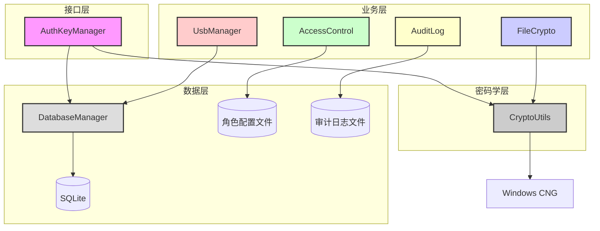
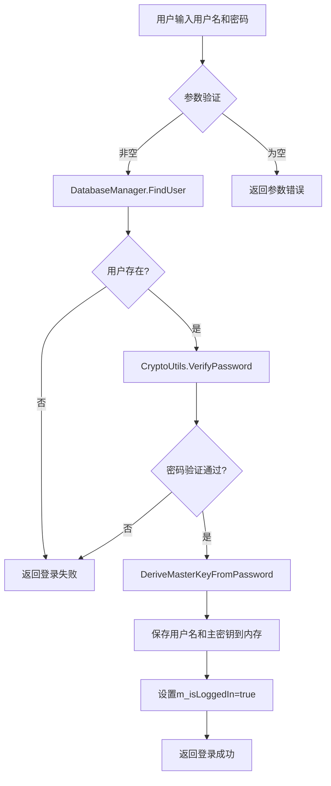
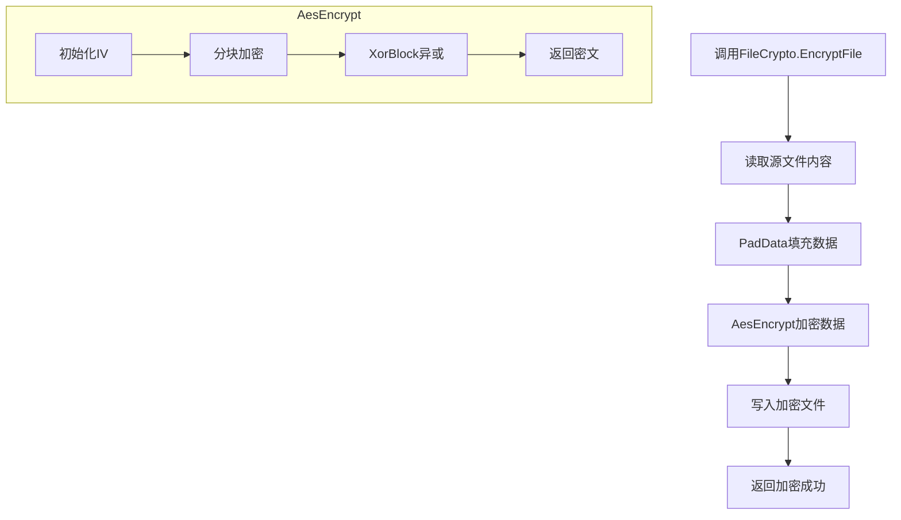
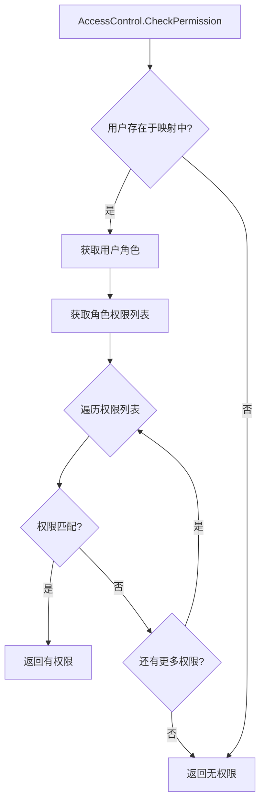
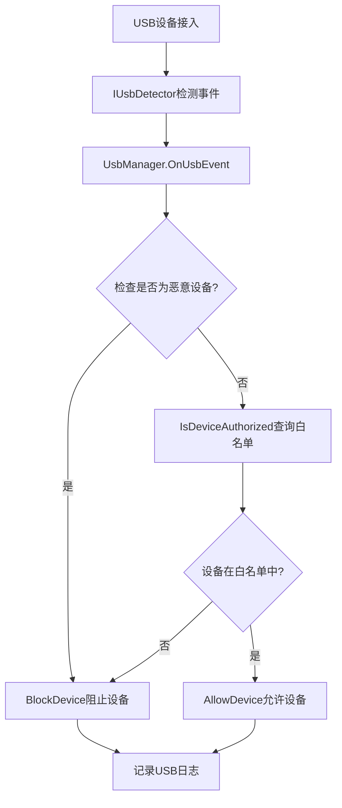
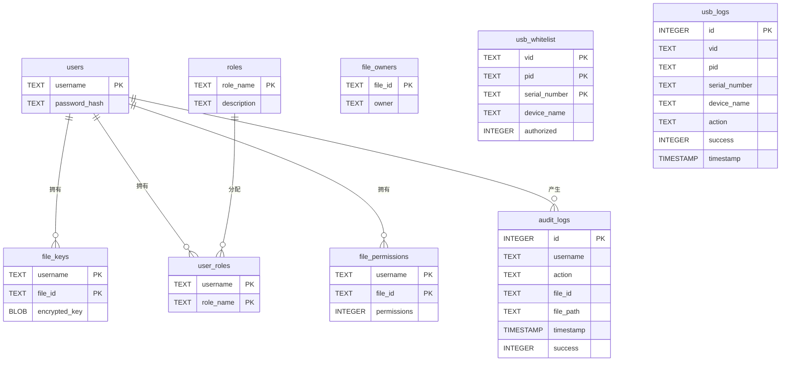
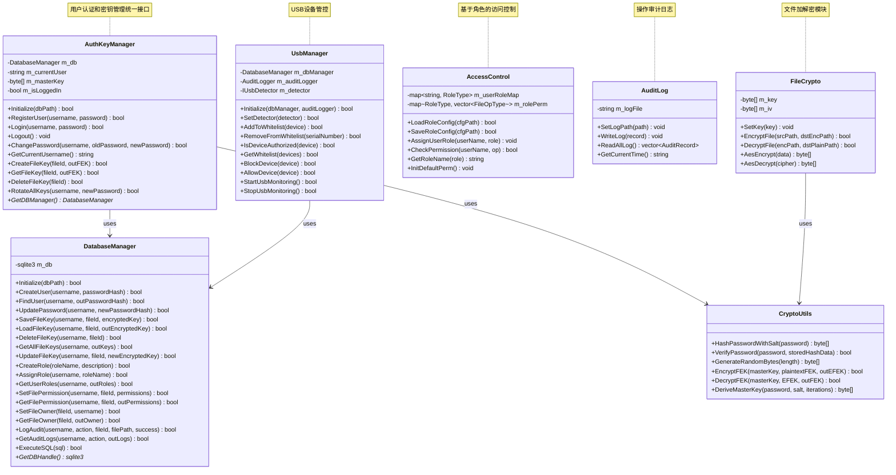

# SecureAuthKeyModule3.0 设计文档

---

## 版本历史

| 版本 | 日期 | 作者 | 变更说明 |
| :--- | :--- | :--- | :--- |
| V1.0 | 2026-07-06 | 自动生成 | 基于SecureAuthKeyModule3.0代码编写 |

---

## 一、引言

### 1.1 编写目的

本文档详细描述SecureAuthKeyModule3.0的系统架构设计、模块划分、数据库设计、接口设计和安全设计，为开发人员提供清晰的实现指导，确保系统满足信息系统安全课程设计的要求。

### 1.2 项目背景

文件访问控制系统是信息安全领域的重要组成部分，用于保护敏感文件资源。SecureAuthKeyModule3.0是一个安全认证与密钥管理模块，基于Windows CNG密码学库实现，提供用户认证、密钥管理、文件加密、访问控制、审计日志和USB端口管控等功能。

### 1.3 设计目标

- **安全性**：密码使用SHA-256加盐哈希存储，主密钥仅在内存中临时存储，文件加密使用AES算法
- **可扩展性**：模块化设计，各模块独立，便于功能扩展和维护
- **可靠性**：完整的错误处理和日志记录机制
- **易用性**：提供统一的接口，便于集成到文件访问控制系统中

### 1.4 技术栈

| 分类 | 技术 | 版本 |
| :--- | :--- | :--- |
| 操作系统 | Windows | 10/11（64位） |
| 开发语言 | C++ | C++17 |
| 开发工具 | Visual Studio | 2022 |
| 密码学库 | Windows CNG | bcrypt.lib |
| 数据库 | SQLite | 3.0+ |

---

## 二、系统架构设计

### 2.1 架构概述

系统采用**分层架构**设计，分为四层：接口层、业务层、密码学层和数据层。各层职责明确，通过接口进行通信，降低模块间的耦合度。



### 2.2 模块划分

| 模块 | 职责 | 核心类 |
| :--- | :--- | :--- |
| **AuthKeyManager** | 用户认证和密钥管理的统一接口 | AuthKeyManager |
| **CryptoUtils** | 密码学工具函数（哈希、随机数、AES加密） | CryptoUtils |
| **DatabaseManager** | SQLite数据库操作封装 | DatabaseManager |
| **FileCrypto** | 文件级加密解密（课程演示用简化AES） | FileCrypto |
| **AccessControl** | 基于角色的访问控制（RBAC） | AccessControl |
| **AuditLog** | 操作审计日志记录和查询 | AuditLog |
| **UsbManager** | USB设备白名单管理和事件监控 | UsbManager, IUsbDetector, SimulateUsbDetector |

### 2.3 核心流程图

#### 2.3.1 用户登录流程



#### 2.3.2 文件加密流程



#### 2.3.3 权限检查流程



#### 2.3.4 USB设备管控流程



---

## 三、模块详细设计

### 3.1 AuthKeyManager模块

**职责**：用户认证和密钥管理的统一接口，协调DatabaseManager和CryptoUtils完成用户注册、登录、密钥管理等功能。

**类结构**：

| 成员变量 | 类型 | 说明 |
| :--- | :--- | :--- |
| m_db | std::unique_ptr\<DatabaseManager\> | 数据库管理器指针 |
| m_currentUser | std::wstring | 当前登录用户名 |
| m_masterKey | std::vector\<BYTE\> | 当前用户主密钥（内存中临时存储） |
| m_isLoggedIn | bool | 是否登录状态 |

**核心方法**：

| 方法 | 参数 | 返回值 | 说明 |
| :--- | :--- | :--- | :--- |
| Initialize | dbPath: std::wstring | bool | 初始化数据库连接 |
| RegisterUser | username, password: std::wstring | bool | 用户注册，存储密码哈希 |
| Login | username, password: std::wstring | bool | 用户登录，验证密码并派生主密钥 |
| Logout | 无 | void | 用户登出，安全清除主密钥 |
| ChangePassword | username, oldPassword, newPassword: std::wstring | bool | 修改密码，执行密钥轮换 |
| CreateFileKey | fileId: std::wstring, outFEK: std::vector\<BYTE\>& | bool | 创建文件加密密钥FEK |
| GetFileKey | fileId: std::wstring, outFEK: std::vector\<BYTE\>& | bool | 获取文件加密密钥FEK |
| DeleteFileKey | fileId: std::wstring | bool | 删除文件加密密钥 |
| RotateAllKeys | username, newPassword: std::wstring | bool | 轮换所有文件密钥 |

**关键实现逻辑**：

- **密码存储**：注册时调用CryptoUtils.HashPasswordWithSalt生成加盐哈希，存储到数据库
- **密码验证**：登录时调用CryptoUtils.VerifyPassword验证密码
- **主密钥派生**：登录成功后调用DeriveMasterKeyFromPassword派生32字节主密钥
- **FEK管理**：创建FEK时生成随机字节，使用主密钥加密后存储（EFEK格式：Nonce(12)+Tag(16)+Ciphertext(32)）
- **密钥轮换**：修改密码时使用旧主密钥解密所有EFEK，使用新主密钥重新加密

### 3.2 CryptoUtils模块

**职责**：密码学工具函数封装，基于Windows CNG API实现哈希计算、随机数生成、AES-GCM加密解密。

**核心方法**：

| 方法 | 参数 | 返回值 | 说明 |
| :--- | :--- | :--- | :--- |
| HashPasswordWithSalt | password: std::wstring | std::vector\<BYTE\> | 生成加盐SHA-256哈希（Salt 16字节 + Hash 32字节） |
| VerifyPassword | password: std::wstring, storedHashData: std::vector\<BYTE\> | bool | 验证密码是否匹配存储的哈希 |
| GenerateRandomBytes | length: size_t | std::vector\<BYTE\> | 生成指定长度的随机字节 |
| EncryptFEK | masterKey, plaintextFEK: std::vector\<BYTE\>, outEFEK: std::vector\<BYTE\>& | bool | AES-256-GCM加密FEK |
| DecryptFEK | masterKey, EFEK: std::vector\<BYTE\>, outFEK: std::vector\<BYTE\>& | bool | AES-256-GCM解密FEK |
| DeriveMasterKey | password: std::wstring, salt: std::vector\<BYTE\>, iterations: int | std::vector\<BYTE\> | PBKDF2派生主密钥 |

**加密格式**：

- **EFEK格式**：Nonce(12字节) + Tag(16字节) + Ciphertext(32字节) = 60字节
- **密码哈希格式**：Salt(16字节) + SHA256 Hash(32字节) = 48字节

### 3.3 DatabaseManager模块

**职责**：SQLite数据库操作封装，提供用户管理、文件密钥管理、角色权限管理、审计日志管理等数据库操作。

**核心方法**：

| 方法 | 参数 | 返回值 | 说明 |
| :--- | :--- | :--- | :--- |
| Initialize | dbPath: std::wstring | bool | 初始化数据库连接 |
| CreateUser | username, passwordHash: std::wstring | bool | 创建用户记录 |
| FindUser | username: std::wstring, outPasswordHash: std::string& | bool | 查询用户密码哈希 |
| UpdatePassword | username, newPasswordHash: std::wstring | bool | 更新用户密码 |
| SaveFileKey | username, fileId: std::wstring, encryptedKey: std::vector\<BYTE\> | bool | 保存文件密钥 |
| LoadFileKey | username, fileId: std::wstring, outEncryptedKey: std::vector\<BYTE\>& | bool | 加载文件密钥 |
| DeleteFileKey | username, fileId: std::wstring | bool | 删除文件密钥 |
| GetAllFileKeys | username: std::wstring, outKeys: std::vector\<std::pair\<std::wstring, std::vector\<BYTE\>\>\>& | bool | 获取用户所有文件密钥 |
| CreateRole | roleName, description: std::wstring | bool | 创建角色 |
| AssignRole | username, roleName: std::wstring | bool | 分配角色给用户 |
| SetFilePermission | username, fileId: std::wstring, permissionFlags: int | bool | 设置文件权限 |
| SetFileOwner | fileId, username: std::wstring | bool | 设置文件所有者 |
| LogAudit | username, action, fileId, filePath: std::wstring, success: bool | bool | 记录审计日志 |

### 3.4 FileCrypto模块

**职责**：文件级加密解密功能（课程演示用简化实现），使用AES-128加密，支持PKCS7填充。

**类结构**：

| 成员变量 | 类型 | 说明 |
| :--- | :--- | :--- |
| m_key | std::vector\<uint8_t\> | 加密密钥（16字节） |
| m_iv | std::vector\<uint8_t\> | 初始化向量（16字节） |

**核心方法**：

| 方法 | 参数 | 返回值 | 说明 |
| :--- | :--- | :--- | :--- |
| SetKey | key: std::vector\<uint8_t\> | void | 设置加密密钥 |
| EncryptFile | srcPath, dstEncPath: std::string | bool | 加密文件 |
| DecryptFile | encPath, dstPlainPath: std::string | bool | 解密文件 |
| AesEncrypt | data: std::vector\<uint8_t\> | std::vector\<uint8_t\> | AES加密数据 |
| AesDecrypt | cipher: std::vector\<uint8_t\> | std::vector\<uint8_t\> | AES解密数据 |

**加密模式**：

- 算法：AES-128
- 模式：ECB（课程演示简化，固定IV）
- 填充：PKCS7

### 3.5 AccessControl模块

**职责**：基于角色的访问控制（RBAC），管理用户角色分配和权限检查。

**类结构**：

| 成员变量 | 类型 | 说明 |
| :--- | :--- | :--- |
| m_userRoleMap | std::map\<std::string, RoleType\> | 用户-角色映射（内存存储） |
| m_rolePerm | std::map\<RoleType, std::vector\<FileOpType\>\> | 角色-权限映射 |

**角色定义**：

| 角色 | 权限 | 说明 |
| :--- | :--- | :--- |
| ROLE_ADMIN | OP_READ, OP_WRITE, OP_MODIFY, OP_DOWNLOAD | 管理员：全部权限 |
| ROLE_EDITOR | OP_READ, OP_WRITE, OP_MODIFY | 编辑员：读写修改，禁止下载 |
| ROLE_VIEWER | OP_READ | 浏览者：仅读取 |
| ROLE_GUEST | 无 | 访客：无权限 |

**操作类型**：

| 操作 | 说明 |
| :--- | :--- |
| OP_READ | 读取文件 |
| OP_WRITE | 写入文件 |
| OP_MODIFY | 修改文件 |
| OP_DOWNLOAD | 导出下载文件 |

**核心方法**：

| 方法 | 参数 | 返回值 | 说明 |
| :--- | :--- | :--- | :--- |
| InitDefaultPerm | 无 | void | 初始化默认角色权限配置 |
| AssignUserRole | userName: std::string, r: RoleType | void | 分配用户角色 |
| CheckPermission | userName: std::string, op: FileOpType | bool | 检查用户操作权限 |
| LoadRoleConfig | cfgPath: std::string | bool | 从文件加载权限配置 |
| SaveRoleConfig | cfgPath: std::string | bool | 保存权限配置到文件 |

### 3.6 AuditLog模块

**职责**：操作审计日志记录和查询，日志存储到本地文件。

**日志记录结构**：

| 字段 | 类型 | 说明 |
| :--- | :--- | :--- |
| userName | std::string | 操作用户名 |
| filePath | std::string | 操作文件路径 |
| opType | FileOpType | 操作类型 |
| opTime | std::string | 操作时间 |
| isPermit | bool | 是否允许访问 |
| desc | std::string | 备注信息 |

**日志文件格式**：

```
时间|用户名|操作类型|文件路径|允许/拒绝|备注
```

**核心方法**：

| 方法 | 参数 | 返回值 | 说明 |
| :--- | :--- | :--- | :--- |
| SetLogPath | path: std::string | void | 设置日志文件路径 |
| WriteLog | record: AuditRecord | void | 写入一条审计日志 |
| ReadAllLog | 无 | std::vector\<AuditRecord\> | 读取全部日志 |
| GetCurrentTime | 无 | std::string | 获取当前时间字符串 |

### 3.7 UsbManager模块

**职责**：USB设备白名单管理和事件监控，支持设备授权验证和恶意设备识别。

**设备信息结构**：

| 字段 | 类型 | 说明 |
| :--- | :--- | :--- |
| vid | std::wstring | 设备厂商ID |
| pid | std::wstring | 设备产品ID |
| serialNumber | std::wstring | 设备序列号 |
| deviceName | std::wstring | 设备名称 |
| driveLetter | std::wstring | 驱动器盘符 |
| pnpDeviceId | std::wstring | PnP设备ID |
| isStorage | bool | 是否存储设备 |
| isAuthorized | bool | 是否已授权 |

**USB操作类型**：

| 操作 | 说明 |
| :--- | :--- |
| INSERT | 设备接入 |
| REMOVE | 设备移除 |
| ALLOW | 允许设备 |
| DENY | 拒绝设备 |
| BLOCKED | 设备被阻止 |

**核心方法**：

| 方法 | 参数 | 返回值 | 说明 |
| :--- | :--- | :--- | :--- |
| Initialize | dbManager: DatabaseManager*, auditLogger: AuditLogger* | bool | 初始化USB管理器 |
| SetDetector | detector: std::unique_ptr\<IUsbDetector\> | bool | 设置USB检测器 |
| AddToWhitelist | device: UsbDeviceInfo | bool | 添加设备到白名单 |
| RemoveFromWhitelist | serialNumber: std::wstring | bool | 从白名单移除设备 |
| IsDeviceAuthorized | device: UsbDeviceInfo | bool | 验证设备是否已授权 |
| GetWhitelist | devices: std::vector\<UsbDeviceInfo\>& | bool | 获取白名单设备列表 |
| BlockDevice | device: UsbDeviceInfo | bool | 阻止设备接入 |
| AllowDevice | device: UsbDeviceInfo | bool | 允许设备接入 |
| StartUsbMonitoring | 无 | bool | 启动USB监控 |
| StopUsbMonitoring | 无 | bool | 停止USB监控 |

**恶意设备检测**：

- 检测规则：VID/PID为0xFFFF的设备判定为恶意设备
- 处理方式：自动阻止并记录日志

---

## 四、数据库设计

### 4.1 数据库表结构

#### 4.1.1 users表（用户表）

| 字段名 | 类型 | 约束 | 说明 |
| :--- | :--- | :--- | :--- |
| username | TEXT | PRIMARY KEY | 用户名 |
| password_hash | TEXT | NOT NULL | 密码哈希值（Salt+Hash） |

#### 4.1.2 file_keys表（文件密钥表）

| 字段名 | 类型 | 约束 | 说明 |
| :--- | :--- | :--- | :--- |
| username | TEXT | PRIMARY KEY | 关联用户名 |
| file_id | TEXT | PRIMARY KEY | 文件ID |
| encrypted_key | BLOB | NOT NULL | 加密后的FEK（EFEK） |

#### 4.1.3 roles表（角色表）

| 字段名 | 类型 | 约束 | 说明 |
| :--- | :--- | :--- | :--- |
| role_name | TEXT | PRIMARY KEY | 角色名称 |
| description | TEXT | | 角色描述 |

#### 4.1.4 user_roles表（用户角色表）

| 字段名 | 类型 | 约束 | 说明 |
| :--- | :--- | :--- | :--- |
| username | TEXT | PRIMARY KEY | 关联用户名 |
| role_name | TEXT | PRIMARY KEY | 关联角色名称 |

#### 4.1.5 file_permissions表（文件权限表）

| 字段名 | 类型 | 约束 | 说明 |
| :--- | :--- | :--- | :--- |
| username | TEXT | PRIMARY KEY | 关联用户名 |
| file_id | TEXT | PRIMARY KEY | 关联文件ID |
| permissions | INTEGER | NOT NULL | 权限标志位 |

#### 4.1.6 file_owners表（文件所有者表）

| 字段名 | 类型 | 约束 | 说明 |
| :--- | :--- | :--- | :--- |
| file_id | TEXT | PRIMARY KEY | 文件ID |
| owner | TEXT | NOT NULL | 所有者用户名 |

#### 4.1.7 audit_logs表（审计日志表）

| 字段名 | 类型 | 约束 | 说明 |
| :--- | :--- | :--- | :--- |
| id | INTEGER | PRIMARY KEY AUTOINCREMENT | 日志ID |
| username | TEXT | NOT NULL | 操作用户名 |
| action | TEXT | NOT NULL | 操作类型 |
| file_id | TEXT | | 文件ID |
| file_path | TEXT | | 文件路径 |
| timestamp | TIMESTAMP | NOT NULL | 操作时间 |
| success | INTEGER | NOT NULL | 操作结果（0/1） |

#### 4.1.8 usb_whitelist表（USB白名单表）

| 字段名 | 类型 | 约束 | 说明 |
| :--- | :--- | :--- | :--- |
| vid | TEXT | PRIMARY KEY | 设备VID |
| pid | TEXT | PRIMARY KEY | 设备PID |
| serial_number | TEXT | PRIMARY KEY | 设备序列号 |
| device_name | TEXT | | 设备名称 |
| authorized | INTEGER | NOT NULL | 授权状态（0/1） |

#### 4.1.9 usb_logs表（USB日志表）

| 字段名 | 类型 | 约束 | 说明 |
| :--- | :--- | :--- | :--- |
| id | INTEGER | PRIMARY KEY AUTOINCREMENT | 日志ID |
| vid | TEXT | NOT NULL | 设备VID |
| pid | TEXT | NOT NULL | 设备PID |
| serial_number | TEXT | | 设备序列号 |
| device_name | TEXT | | 设备名称 |
| action | TEXT | NOT NULL | 操作类型 |
| success | INTEGER | NOT NULL | 操作结果（0/1） |
| timestamp | TIMESTAMP | NOT NULL | 操作时间 |

### 4.2 数据库ER图



---

## 五、接口设计

### 5.1 类接口汇总

#### AuthKeyManager接口

```cpp
class AuthKeyManager {
public:
    bool Initialize(const std::wstring& dbPath);
    bool RegisterUser(const std::wstring& username, const std::wstring& password);
    bool Login(const std::wstring& username, const std::wstring& password);
    void Logout();
    bool ChangePassword(const std::wstring& username,
        const std::wstring& oldPassword,
        const std::wstring& newPassword);
    std::wstring GetCurrentUsername() const;
    bool CreateFileKey(const std::wstring& fileId, std::vector<BYTE>& outFEK);
    bool GetFileKey(const std::wstring& fileId, std::vector<BYTE>& outFEK);
    bool DeleteFileKey(const std::wstring& fileId);
    bool RotateAllKeys(const std::wstring& username, const std::wstring& newPassword);
    static void SecureZeroMemory(BYTE* buffer, size_t size);
    DatabaseManager* GetDBManager();
};
```

#### CryptoUtils接口

```cpp
class CryptoUtils {
public:
    static std::vector<BYTE> HashPasswordWithSalt(const std::wstring& password);
    static bool VerifyPassword(const std::wstring& password, const std::vector<BYTE>& storedHashData);
    static std::vector<BYTE> GenerateRandomBytes(size_t length);
    static bool EncryptFEK(const std::vector<BYTE>& masterKey,
        const std::vector<BYTE>& plaintextFEK,
        std::vector<BYTE>& outEFEK);
    static bool DecryptFEK(const std::vector<BYTE>& masterKey,
        const std::vector<BYTE>& EFEK,
        std::vector<BYTE>& outFEK);
    static std::vector<BYTE> DeriveMasterKey(const std::wstring& password, 
        const std::vector<BYTE>& salt, int iterations = 100000);
};
```

#### DatabaseManager接口

```cpp
class DatabaseManager {
public:
    bool Initialize(const std::wstring& dbPath);
    bool CreateUser(const std::wstring& username, const std::wstring& passwordHash);
    bool FindUser(const std::wstring& username, std::string& outPasswordHash);
    bool UpdatePassword(const std::wstring& username, const std::wstring& newPasswordHash);
    bool SaveFileKey(const std::wstring& username, const std::wstring& fileId, 
        const std::vector<BYTE>& encryptedKey);
    bool LoadFileKey(const std::wstring& username, const std::wstring& fileId, 
        std::vector<BYTE>& outEncryptedKey);
    bool DeleteFileKey(const std::wstring& username, const std::wstring& fileId);
    bool GetAllFileKeys(const std::wstring& username, 
        std::vector<std::pair<std::wstring, std::vector<BYTE>>>& outKeys);
    bool UpdateFileKey(const std::wstring& username, const std::wstring& fileId, 
        const std::vector<BYTE>& newEncryptedKey);
    bool CreateRole(const std::wstring& roleName, const std::wstring& description);
    bool AssignRole(const std::wstring& username, const std::wstring& roleName);
    bool GetUserRoles(const std::wstring& username, std::vector<std::wstring>& outRoles);
    bool SetFilePermission(const std::wstring& username, const std::wstring& fileId, int permissionFlags);
    bool GetFilePermission(const std::wstring& username, const std::wstring& fileId, int& outPermissionFlags);
    bool LogAudit(const std::wstring& username, const std::wstring& action,
                  const std::wstring& fileId, const std::wstring& filePath, bool success);
    bool GetAuditLogs(const std::wstring& username, const std::wstring& action,
                      std::vector<std::pair<std::wstring, std::wstring>>& outLogs);
    bool SetFileOwner(const std::wstring& fileId, const std::wstring& username);
    bool GetFileOwner(const std::wstring& fileId, std::wstring& outUsername);
    void Close();
    sqlite3* GetDBHandle();
};
```

#### FileCrypto接口

```cpp
class FileCrypto {
public:
    void SetKey(const std::vector<uint8_t>& key);
    bool EncryptFile(const std::string& srcPath, const std::string& dstEncPath);
    bool DecryptFile(const std::string& encPath, const std::string& dstPlainPath);
    std::vector<uint8_t> AesEncrypt(const std::vector<uint8_t>& data);
    std::vector<uint8_t> AesDecrypt(const std::vector<uint8_t>& cipher);
};
```

#### AccessControl接口

```cpp
class AccessControl {
public:
    bool LoadRoleConfig(const std::string& cfgPath);
    bool SaveRoleConfig(const std::string& cfgPath);
    void AssignUserRole(const std::string& userName, RoleType r);
    bool CheckPermission(const std::string& userName, FileOpType op);
    std::string GetRoleName(RoleType r);
    void InitDefaultPerm();
};
```

#### AuditLog接口

```cpp
class AuditLog {
public:
    void SetLogPath(const std::string& path);
    void WriteLog(const AuditRecord& record);
    std::vector<AuditRecord> ReadAllLog();
    std::string GetCurrentTime();
};
```

#### UsbManager接口

```cpp
class UsbManager {
public:
    bool Initialize(DatabaseManager* dbManager, AuditLogger* auditLogger);
    bool SetDetector(std::unique_ptr<IUsbDetector> detector);
    bool AddToWhitelist(const UsbDeviceInfo& device);
    bool RemoveFromWhitelist(const std::wstring& serialNumber);
    bool IsDeviceAuthorized(const UsbDeviceInfo& device);
    bool GetWhitelist(std::vector<UsbDeviceInfo>& devices);
    bool BlockDevice(const UsbDeviceInfo& device);
    bool AllowDevice(const UsbDeviceInfo& device);
    bool StartUsbMonitoring();
    bool StopUsbMonitoring();
    static std::wstring UsbActionToString(UsbAction action);
    static UsbAction StringToUsbAction(const std::wstring& actionStr);
};
```

### 5.2 模块交互关系



---

## 六、安全设计

### 6.1 密码安全

| 安全措施 | 实现方式 | 防护目标 |
| :--- | :--- | :--- |
| 加盐哈希 | SHA-256 + 16字节随机盐值 | 防止彩虹表攻击 |
| 主密钥派生 | PBKDF2算法，100000次迭代 | 防止暴力破解 |
| 安全清除 | SecureZeroMemory清除内存密钥 | 防止内存dump攻击 |
| 密钥轮换 | 修改密码时重新加密所有FEK | 防止旧密码泄露导致密钥泄露 |

### 6.2 密钥管理

| 安全措施 | 实现方式 | 防护目标 |
| :--- | :--- | :--- |
| FEK加密存储 | AES-256-GCM加密FEK为EFEK | 保护文件加密密钥 |
| 随机FEK生成 | CryptoUtils.GenerateRandomBytes | 确保密钥随机性 |
| 主密钥内存存储 | 仅在登录后加载，登出时清除 | 减少密钥暴露时间 |
| EFEK格式 | Nonce(12)+Tag(16)+Ciphertext(32) | 支持认证加密，防止篡改 |

### 6.3 访问控制

| 安全措施 | 实现方式 | 防护目标 |
| :--- | :--- | :--- |
| RBAC模型 | 角色-权限映射，用户-角色映射 | 细粒度权限管理 |
| 权限检查 | 每次操作前验证权限 | 防止越权访问 |
| 默认权限 | 访客无权限，最小权限原则 | 防止权限过度授予 |
| 文件所有者 | 文件所有者拥有全部权限 | 支持自主访问控制 |

### 6.4 审计日志

| 安全措施 | 实现方式 | 防护目标 |
| :--- | :--- | :--- |
| 全操作记录 | 记录所有用户操作 | 安全事件追溯 |
| 操作结果记录 | 记录允许/拒绝状态 | 检测异常访问 |
| 时间戳记录 | 精确到秒的时间记录 | 事件时序分析 |
| 本地文件存储 | 日志文件独立存储 | 防止日志篡改 |

### 6.5 USB管控

| 安全措施 | 实现方式 | 防护目标 |
| :--- | :--- | :--- |
| 白名单机制 | 设备VID/PID/序列号验证 | 防止未授权设备接入 |
| 恶意设备检测 | VID/PID为0xFFFF判定为恶意 | 防止恶意设备攻击 |
| USB监控 | 设备接入/移除事件监听 | 实时监控设备状态 |
| 事件日志 | 记录所有USB事件 | 设备操作追溯 |

### 6.6 数据库安全

| 安全措施 | 实现方式 | 防护目标 |
| :--- | :--- | :--- |
| 参数化查询 | SQLite参数绑定 | 防止SQL注入攻击 |
| 加密存储 | FEK以BLOB加密存储 | 保护密钥数据 |
| 独立数据库 | 每个用户独立数据 | 数据隔离 |

---

## 七、部署与集成

### 7.1 项目结构

```
SecureAuthKeyModule3.0/
├── SecureAuthKeyModule/
│   └── SecureAuthKeyModule/
│       ├── AuthKeyManager.h/cpp          # 用户认证和密钥管理
│       ├── CryptoUtils.h/cpp             # 密码学工具
│       ├── DatabaseManager.h/cpp         # 数据库操作
│       ├── FileCrypto.h/cpp              # 文件加解密
│       ├── AccessControl.h/cpp           # 访问控制
│       ├── AuditLog.h/cpp                # 审计日志
│       ├── UsbManager.h/cpp              # USB管控
│       ├── sqlite3.c/sqlite3.h           # SQLite数据库
│       ├── dllmain.cpp                   # DLL入口
│       ├── main.cpp                      # 测试程序
│       ├── SecureAuthKeyModule.sln       # VS解决方案
│       └── x64/Debug/                    # 编译输出
│           ├── SecureAuthKeyModule.dll   # DLL文件
│           └── TestAuthKey.exe           # 测试程序
```

### 7.2 编译要求

| 项目 | 要求 |
| :--- | :--- |
| 编译器 | MSVC 14.3+ (Visual Studio 2022) |
| 平台 | x64 |
| 运行时库 | vcruntime140.dll, msvcp140.dll, ucrtbase.dll |
| 链接库 | bcrypt.lib |

### 7.3 集成方式

1. **DLL集成**：将SecureAuthKeyModule.dll复制到应用程序目录
2. **头文件引用**：包含AuthKeyManager.h等头文件
3. **初始化**：调用AuthKeyManager::Initialize初始化数据库
4. **功能调用**：调用各模块接口实现用户认证、密钥管理、文件加密等功能

---

## 八、代码优化建议

### 8.1 当前实现问题

| 问题 | 影响 | 建议 |
| :--- | :--- | :--- |
| FileCrypto使用ECB模式 | 安全性较低，相同明文产生相同密文 | 改为CBC或GCM模式 |
| FileCrypto使用固定IV | IV应随机生成并随密文一起存储 | 每次加密生成随机IV |
| AccessControl角色权限存储在内存 | 程序重启后配置丢失 | 使用数据库持久化角色权限 |
| AuditLog使用文本文件存储 | 日志查询效率低 | 使用数据库存储审计日志 |
| UsbManager引用AuditLogger但v3.0不存在 | 编译错误 | 修改为使用AuditLog或移除引用 |
| 主密钥派生使用简化方式 | 安全性不足 | 使用标准PBKDF2算法 |

### 8.2 安全增强建议

1. **添加密钥版本管理**：支持密钥版本升级和回滚
2. **实现密钥备份功能**：支持加密密钥的安全备份和恢复
3. **增加多线程安全支持**：添加线程同步机制
4. **实现真实USB设备检测**：基于Windows API实现真实USB设备检测
5. **添加加密文件格式版本管理**：支持不同版本加密文件格式的兼容处理
6. **改进审计日志查询功能**：支持按时间范围、用户、操作类型筛选查询