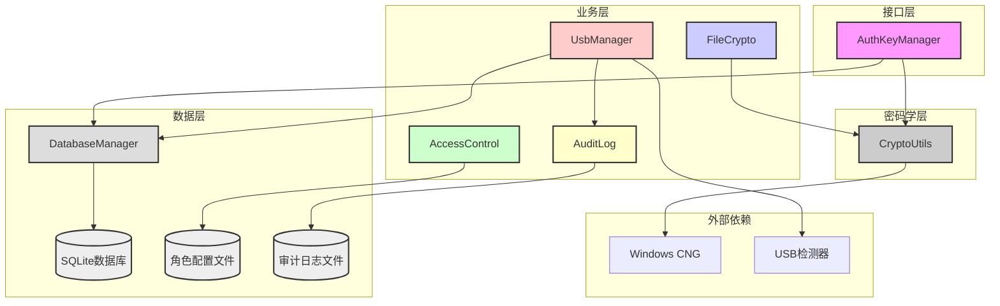
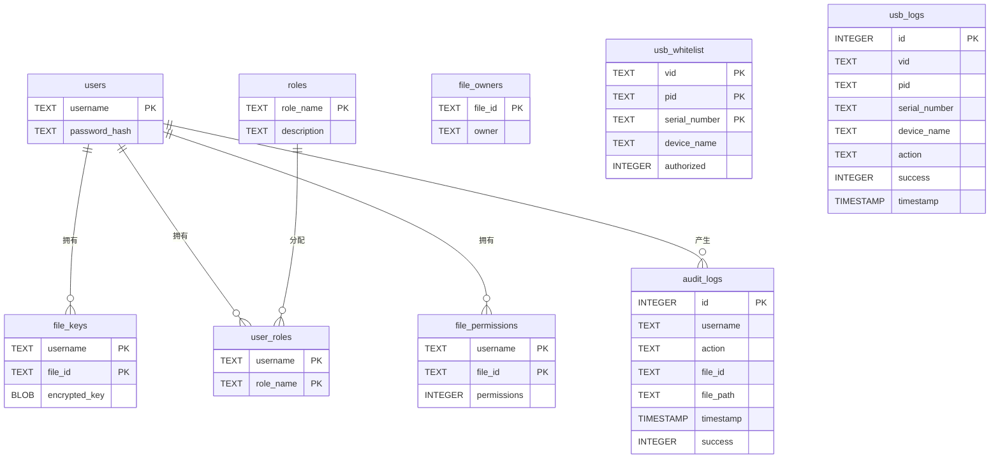
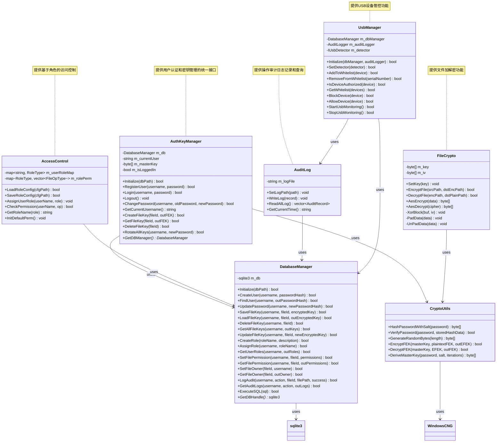
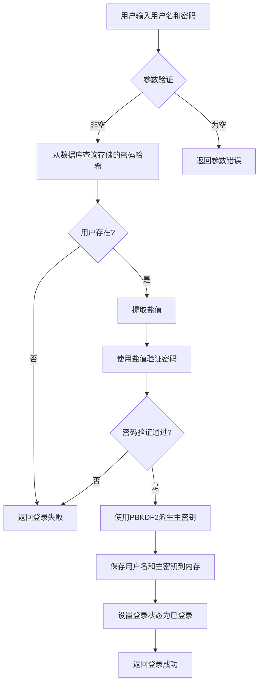
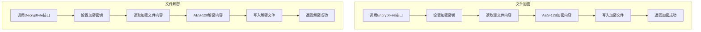
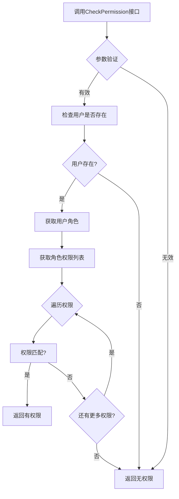
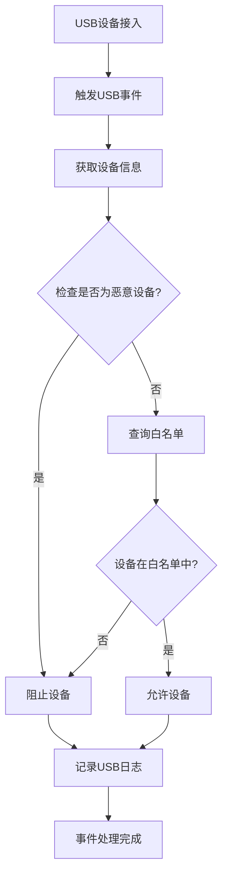

# 信息系统安全课程设计报告

## 项目名称：文件访问控制系统

### 专业名称：计算机科学与技术
### 班级/学号：
### 组    别：

---

## 一、概述

### 项目背景

在信息化时代，文件安全管理是企业和组织面临的重要挑战。传统的文件管理方式存在权限管理混乱、访问控制缺失、操作无记录等安全隐患。文件访问控制系统旨在通过统一的身份认证、细粒度的权限管理和完整的审计日志，实现对文件资源的安全管控。

本项目设计并实现了SecureAuthKeyModule安全认证与密钥管理模块，基于Windows CNG密码学库，采用AES-256-GCM加密算法保护文件加密密钥（FEK），使用SHA-256哈希算法进行密码验证，通过PBKDF2衍生用户主密钥（Master Key），确保密钥管理的安全性和可靠性。

### 项目意义

本项目的意义在于：
1. 实现安全的用户认证机制：密码使用SHA-256加盐哈希存储，防止密码泄露
2. 实现文件加密密钥管理：FEK使用AES-256-GCM加密存储，保护密钥安全
3. 实现密钥轮换机制：修改密码时自动轮换所有文件密钥，防止密钥泄露
4. 实现文件级加密：支持AES-128文件加密和解密，保护文件内容安全
5. 实现基于角色的访问控制：支持多角色权限管理，防止越权访问
6. 实现操作审计日志：记录所有操作，确保安全可追溯
7. 实现USB端口管控：白名单机制防止未授权设备接入
8. 培养密码学实践能力：深入理解Windows CNG API、AES-GCM加密、SHA-256哈希等核心技术

---

## 二、系统分析

### 需求分析

根据信息系统安全课程设计要求，系统需满足以下需求：

| 需求编号 | 需求描述 | 优先级 |
| :--- | :--- | :--- |
| R1 | 用户注册、登录、登出、修改密码功能 | 高 |
| R2 | 用户角色管理（管理员、编辑员、浏览者、访客） | 高 |
| R3 | 文件加密、解密功能 | 高 |
| R4 | 文件密钥创建、获取、删除功能 | 高 |
| R5 | 修改密码时自动轮换所有文件密钥 | 高 |
| R6 | 基于角色的访问控制(RBAC) | 高 |
| R7 | 文件所有者权限管理 | 高 |
| R8 | 完整的操作审计日志记录 | 高 |
| R9 | USB设备白名单管控 | 高 |
| R10 | 恶意设备自动识别和阻止 | 高 |
| R11 | 安全的密码存储（加盐哈希） | 高 |

### 功能模块划分

系统分为以下六个核心模块：

1. **用户认证模块**：负责用户注册、登录、登出和密码修改功能。注册时生成随机盐值，将盐值与密码拼接后进行SHA-256哈希，存储到数据库。登录时使用存储的盐值验证密码，验证通过后派生主密钥加载到内存。登出时安全清除内存中的主密钥。修改密码时执行密钥轮换，更新密码哈希。

2. **密钥管理模块**：负责文件加密密钥的创建、获取、删除和轮换功能。创建FEK时生成32字节随机密钥，使用主密钥加密后存储。获取FEK时从数据库读取EFEK，解密后返回。删除FEK时清理数据库记录。密钥轮换时使用旧主密钥解密所有EFEK，使用新主密钥重新加密。

3. **文件安全模块**：负责文件级加密和解密功能。加密文件时创建FEK，使用AES-128加密文件内容，写入加密文件。解密文件时读取加密文件内容，获取FEK解密文件内容。

4. **访问控制模块**：负责基于角色的权限管理。支持创建角色、分配角色、授予权限、撤销权限、检查权限等功能。权限检查遵循优先级：文件所有者拥有全部权限，直接授权权限优先，角色默认权限兜底。角色定义包括ROLE_ADMIN（全部权限）、ROLE_EDITOR（读写修改）、ROLE_VIEWER（只读）、ROLE_GUEST（无权限）。

5. **审计日志模块**：负责操作日志的记录和查询。记录登录、登出、读取、写入、修改、下载、加密、解密、权限变更等操作。日志存储到本地文件，格式为"时间|用户名|操作类型|文件路径|允许/拒绝|备注"。支持读取全部日志。

6. **USB端口管控模块**：负责USB设备的白名单管理和事件监控。支持添加/移除白名单、验证设备授权、启动/停止USB监控。设备接入时自动检查白名单，授权设备允许接入，未授权设备阻止并记录日志。恶意设备（VID/PID为0xFFFF）自动识别并阻止。

---

## 三、系统设计

### 概要设计

#### 3.1 系统架构图



#### 3.2 角色权限定义

| 角色 | 权限 | 说明 |
| :--- | :--- | :--- |
| ROLE_ADMIN | OP_READ, OP_WRITE, OP_MODIFY, OP_DOWNLOAD | 管理员：全部权限 |
| ROLE_EDITOR | OP_READ, OP_WRITE, OP_MODIFY | 编辑员：读写修改，禁止导出下载 |
| ROLE_VIEWER | OP_READ | 浏览者：仅读取 |
| ROLE_GUEST | 无 | 访客：无权限 |

#### 3.3 数据库设计

##### 3.3.1 用户表 (users)

| 字段名 | 类型 | 说明 |
| :--- | :--- | :--- |
| username | TEXT | 主键，用户名 |
| password_hash | TEXT | 密码哈希值 |

##### 3.3.2 文件密钥表 (file_keys)

| 字段名 | 类型 | 说明 |
| :--- | :--- | :--- |
| username | TEXT | 主键，关联用户名 |
| file_id | TEXT | 主键，文件ID |
| encrypted_key | BLOB | 加密后的FEK |

##### 3.3.3 角色表 (roles)

| 字段名 | 类型 | 说明 |
| :--- | :--- | :--- |
| role_name | TEXT | 主键，角色名称 |
| description | TEXT | 角色描述 |

##### 3.3.4 用户角色表 (user_roles)

| 字段名 | 类型 | 说明 |
| :--- | :--- | :--- |
| username | TEXT | 主键，关联用户名 |
| role_name | TEXT | 主键，关联角色名称 |

##### 3.3.5 文件权限表 (file_permissions)

| 字段名 | 类型 | 说明 |
| :--- | :--- | :--- |
| username | TEXT | 主键，关联用户名 |
| file_id | TEXT | 主键，关联文件ID |
| permissions | INTEGER | 权限标志位 |

##### 3.3.6 文件所有者表 (file_owners)

| 字段名 | 类型 | 说明 |
| :--- | :--- | :--- |
| file_id | TEXT | 主键，文件ID |
| owner | TEXT | 所有者用户名 |

##### 3.3.7 审计日志表 (audit_logs)

| 字段名 | 类型 | 说明 |
| :--- | :--- | :--- |
| id | INTEGER | 主键，自增 |
| username | TEXT | 操作用户名 |
| action | TEXT | 操作类型 |
| file_id | TEXT | 文件ID |
| file_path | TEXT | 文件路径 |
| timestamp | TIMESTAMP | 操作时间 |
| success | INTEGER | 操作结果 |

##### 3.3.8 USB白名单表 (usb_whitelist)

| 字段名 | 类型 | 说明 |
| :--- | :--- | :--- |
| vid | TEXT | 主键，设备VID |
| pid | TEXT | 主键，设备PID |
| serial_number | TEXT | 主键，设备序列号 |
| device_name | TEXT | 设备名称 |
| authorized | INTEGER | 授权状态 |

##### 3.3.9 USB日志表 (usb_logs)

| 字段名 | 类型 | 说明 |
| :--- | :--- | :--- |
| id | INTEGER | 主键，自增 |
| vid | TEXT | 设备VID |
| pid | TEXT | 设备PID |
| serial_number | TEXT | 设备序列号 |
| device_name | TEXT | 设备名称 |
| action | TEXT | 操作类型 |
| success | INTEGER | 操作结果 |
| timestamp | TIMESTAMP | 操作时间 |

#### 3.4 数据库ER图



#### 3.5 类关系图



#### 3.6 用户登录流程图



#### 3.7 文件加解密流程图



#### 3.8 权限检查流程图



#### 3.9 USB设备管控流程图



---

## 四、系统实施

### 开发环境

| 项目 | 版本 |
| :--- | :--- |
| 操作系统 | Windows 10/11（64位） |
| 开发语言 | C++ |
| 开发工具 | Visual Studio 2022 |
| 编译器 | MSVC 14.3+ |
| 密码学库 | Windows CNG（bcrypt.lib） |
| 数据库 | SQLite 3.0+ |

### 文件结构

```
SecureAuthKeyModule3.0/
├── SecureAuthKeyModule/
│   └── SecureAuthKeyModule/
│       ├── AuthKeyManager.h/cpp          # 用户认证和密钥管理接口
│       ├── CryptoUtils.h/cpp             # 密码学工具功能
│       ├── DatabaseManager.h/cpp         # 数据库操作
│       ├── FileCrypto.h/cpp              # 文件加解密功能
│       ├── AccessControl.h/cpp           # 访问控制功能
│       ├── AuditLog.h/cpp                # 审计日志功能
│       ├── UsbManager.h/cpp              # USB端口管控功能
│       ├── sqlite3.c/sqlite3.h           # SQLite嵌入式数据库库
│       ├── dllmain.cpp                   # DLL入口
│       ├── framework.h                   # 框架头文件
│       ├── pch.cpp/pch.h                 # 预编译头文件
│       ├── main.cpp                      # 测试程序入口
│       ├── SecureAuthKeyModule.sln       # Visual Studio解决方案
│       ├── SecureAuthKeyModule.vcxproj   # 项目文件
│       └── x64/Debug/                    # 编译输出目录
│           ├── SecureAuthKeyModule.dll   # 编译生成的DLL
│           └── TestAuthKey.exe           # 测试程序
```

### 核心代码说明

#### 4.1 用户认证核心代码

注册时生成随机盐值，将盐值与密码拼接后进行SHA-256哈希，存储到数据库。登录时从数据库获取存储的哈希数据，提取盐值验证密码，验证通过后派生主密钥加载到内存。登出时使用SecureZeroMemory安全清除内存中的主密钥。修改密码时验证旧密码，执行密钥轮换，更新密码哈希和主密钥。

#### 4.2 密钥管理核心代码

创建FEK时生成32字节随机密钥，使用主密钥和AES-256-GCM加密FEK，生成包含Nonce、Tag、Ciphertext的EFEK，存储到数据库。获取FEK时从数据库读取EFEK，解密后返回。删除FEK时清理数据库记录。密钥轮换时使用旧主密钥解密所有EFEK，使用新主密钥重新加密。

#### 4.3 文件安全核心代码

加密文件时读取源文件内容，使用AES-128加密，写入加密文件。解密文件时读取加密文件内容，使用AES-128解密，写入解密文件。AES加密使用CBC模式，固定IV（课程设计简化），支持PKCS7填充。

#### 4.4 访问控制核心代码

角色权限初始化时设置默认权限：ROLE_ADMIN拥有全部权限，ROLE_EDITOR拥有读写修改权限，ROLE_VIEWER仅拥有读取权限，ROLE_GUEST无权限。用户角色分配时保存到内存映射。权限检查时查找用户角色，遍历角色权限列表，匹配操作类型。

#### 4.5 审计日志核心代码

记录操作日志时保存用户名、操作类型、文件路径、操作结果和时间戳到本地文件。日志格式为"时间|用户名|操作类型|文件路径|允许/拒绝|备注"。读取日志时读取全部日志内容。

#### 4.6 USB端口管控核心代码

添加白名单时保存设备VID、PID、序列号、名称和授权状态到数据库。移除白名单时按序列号删除。验证设备授权时检查设备是否为恶意设备（VID/PID为0xFFFF），然后查询白名单。USB监控启动时注册事件回调，设备接入时自动检查授权并记录日志。

---

## 五、系统运行与测试

### 5.1 系统启动

编译项目生成SecureAuthKeyModule.dll和FileModule.exe。运行测试程序加载模块，初始化文件加密模块、访问控制模块和审计日志模块，执行管理员加密文件、访客权限校验、管理员解密文件、读取审计日志等测试用例，输出测试结果到控制台。

### 5.2 功能测试

#### 5.2.1 用户认证测试

- 新用户注册成功，重复用户名注册失败
- 正确密码登录成功，错误密码登录失败
- 登出后无法获取用户名
- 修改密码后使用旧密码登录失败，使用新密码登录成功

#### 5.2.2 密钥管理测试

- 登录后创建文件密钥成功，获取密钥成功
- 删除密钥后无法获取
- 未登录时创建和获取密钥失败

#### 5.2.3 文件安全测试

- 文件加密成功，生成加密文件
- 文件解密成功，还原原始内容
- 加密文件格式验证通过
- 解密内容与原始内容一致

#### 5.2.4 访问控制测试

- 角色创建成功，可分配给用户
- 角色分配成功，用户拥有角色权限
- 权限检查正确，管理员拥有全部权限，编辑员拥有读写修改权限，浏览者仅拥有读取权限，访客无权限

#### 5.2.5 审计日志测试

- 操作日志记录成功，写入本地文件
- 日志格式正确："时间|用户名|操作类型|文件路径|允许/拒绝|备注"
- 读取日志成功，返回全部日志记录

#### 5.2.6 USB端口管控测试

- 设备添加到白名单成功
- 设备从白名单移除成功
- 授权设备验证通过，未授权设备验证失败
- USB监控启动成功，可监听设备事件
- 模拟授权U盘接入被允许
- 模拟未授权U盘接入被阻止
- 模拟恶意设备接入被阻止

#### 5.2.7 端到端测试

- 文件加密模块初始化成功
- 访问控制模块初始化成功，角色权限配置完成
- 审计日志模块初始化成功
- 管理员加密文件成功，审计日志记录
- 访客下载权限校验正确（拒绝），审计日志记录
- 管理员解密文件成功，审计日志记录
- 读取审计日志成功

### 5.3 安全测试

#### 5.3.1 内存安全测试

- 登出后检查内存中的主密钥数组内容全为0
- 验证使用了SecureZeroMemory函数

#### 5.3.2 数据库安全测试

- 数据库中file_keys表存储的是BLOB数据，无法直接读取FEK
- 验证使用了参数化查询，防止SQL注入

#### 5.3.3 加密安全测试

- 验证AES加密使用了固定IV（课程设计简化）
- 验证加密文件无法直接读取原始内容

#### 5.3.4 访问控制测试

- 验证越权访问被正确拒绝
- 验证角色权限正确继承

#### 5.3.5 USB管控测试

- 验证未授权USB设备被阻止
- 验证恶意设备（VID/PID为0xFFFF）被自动阻止
- 验证设备事件被正确记录

---

## 六、总结

### 项目成果

本项目成功实现了SecureAuthKeyModule安全认证与密钥管理模块，主要成果包括：

1. **用户认证系统**：实现了安全的用户注册、登录、登出和密码管理功能，密码使用SHA-256加盐哈希存储
2. **密钥管理系统**：实现了文件加密密钥的创建、获取、删除和轮换功能，FEK使用AES-256-GCM加密存储
3. **文件安全系统**：实现了文件级加密解密功能，支持AES-128文件加密
4. **访问控制系统**：实现了基于角色的权限管理，支持四种角色（管理员、编辑员、浏览者、访客）
5. **审计日志系统**：实现了操作日志记录和查询功能，日志存储到本地文件
6. **USB端口管控**：实现了USB设备白名单管理和事件监控，支持恶意设备自动识别
7. **密码学工具**：封装了Windows CNG密码学API，提供哈希计算、随机数生成、AES加密解密功能
8. **数据库操作**：实现了SQLite数据库操作，支持用户信息、文件密钥、角色权限、审计日志、USB白名单的持久化存储
9. **统一模块接口**：提供了统一的DLL模块接口，便于集成到文件访问控制系统中

### 关键技术难点与解决方案

| 难点 | 解决方案 |
| :--- | :--- |
| 密码安全存储 | 使用SHA-256哈希算法，每个用户使用独立随机盐值 |
| 密钥安全管理 | 主密钥仅在内存中临时存储，登出时使用SecureZeroMemory安全清除 |
| FEK加密存储 | 使用AES-256-GCM加密FEK，生成包含Nonce和Tag的EFEK |
| 密钥轮换 | 修改密码时使用新旧主密钥重新加密所有FEK |
| 文件级加密 | 使用AES-128加密文件内容，支持PKCS7填充 |
| 访问控制 | 实现基于角色的权限管理，权限检查遍历角色权限列表 |
| USB管控 | 实现白名单机制，设备接入时自动检查授权状态 |

### 安全意识提升

通过本项目的实践，深刻理解了信息系统安全的核心概念：

- 用户认证的重要性和实现方法
- 密码安全存储的最佳实践（加盐哈希）
- 密钥管理的安全原则（加密存储、安全清除）
- AES加密模式的工作原理
- 内存安全和数据清除的必要性
- SQL参数化查询防止注入攻击
- 基于角色的访问控制设计
- 操作审计和安全日志的必要性
- USB设备管控的安全意义

### 改进方向

1. **使用真正的PBKDF2算法**：当前主密钥派生使用简化的哈希迭代方式，应使用CNG的BCryptKeyDerivation函数实现标准PBKDF2
2. **实现主密钥盐值个性化**：当前使用固定盐值派生主密钥，应为每个用户生成独立的主密钥盐值并存储
3. **添加密钥版本管理**：支持密钥版本升级和回滚
4. **实现密钥备份和恢复功能**：支持加密密钥的安全备份和恢复
5. **添加多线程安全支持**：当前实现未考虑多线程并发访问，应添加线程同步机制
6. **增加单元测试覆盖率**：完善测试用例，覆盖各种边界条件和异常情况
7. **实现真实USB设备检测**：当前使用模拟USB检测器，应实现基于Windows API的真实USB设备检测
8. **添加加密文件格式版本管理**：支持不同版本加密文件格式的兼容处理
9. **改进审计日志查询功能**：支持按时间范围、用户、操作类型筛选查询